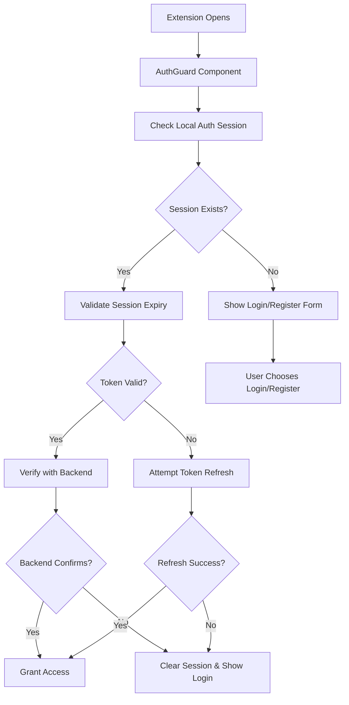
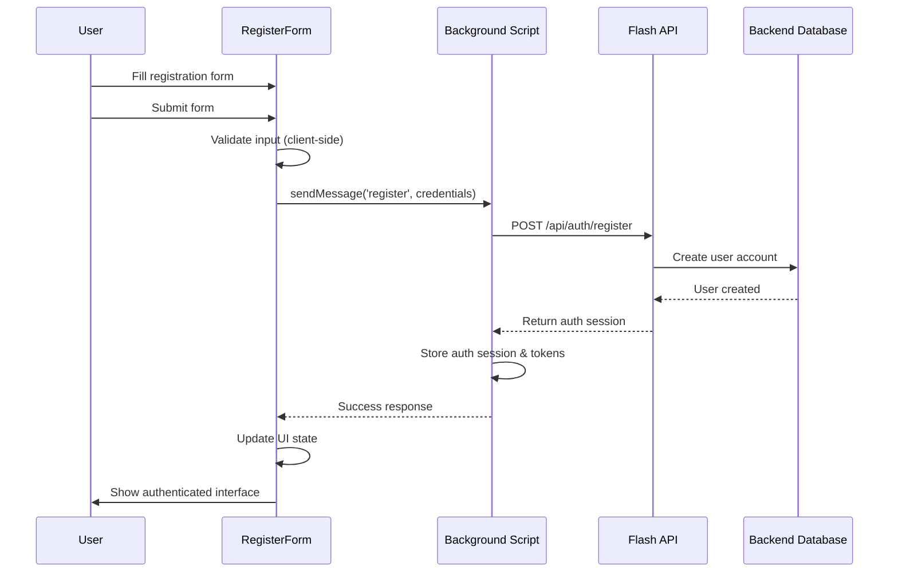
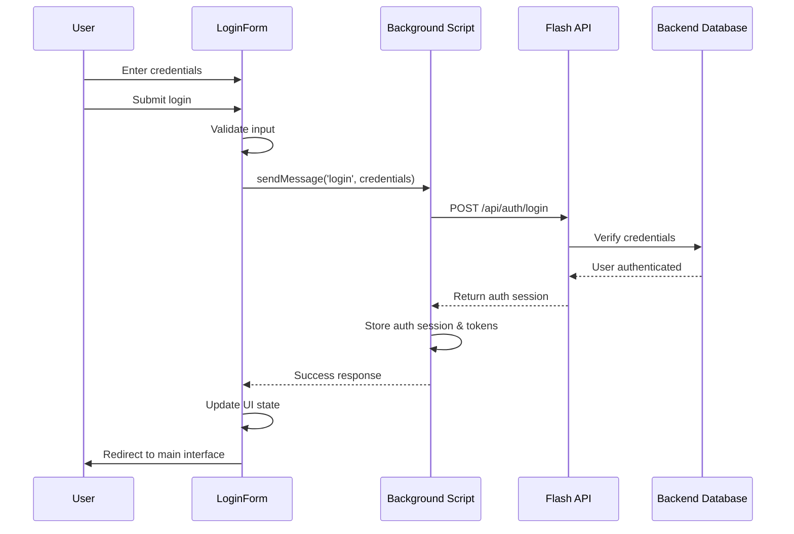
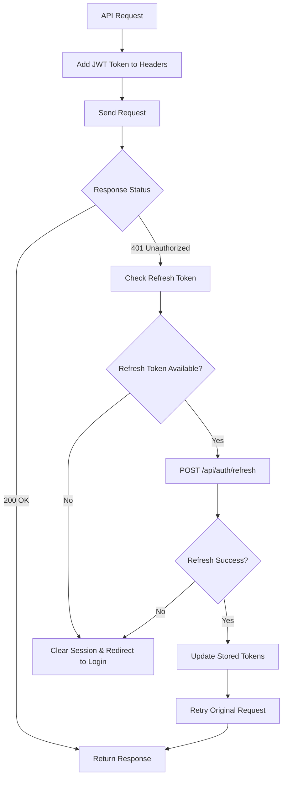
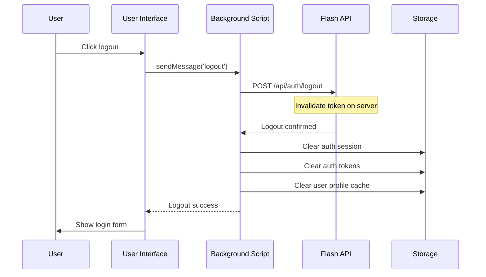
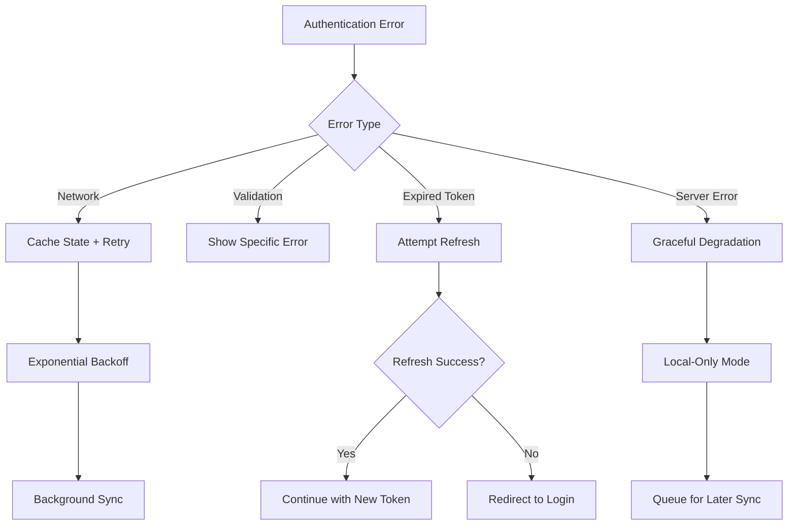

# Flash Extension Authentication Flow

## Overview

The Flash extension implements a comprehensive JWT-based authentication system that provides secure user management while maintaining seamless user experience. The system supports user registration, login, automatic token refresh, and graceful fallback handling.

## Architecture Components

### Frontend Components
- **AuthGuard** - Route protection and authentication state management
- **LoginForm** - User login interface with validation
- **RegisterForm** - User registration interface with validation
- **API Client** - HTTP client with automatic JWT token handling

### Backend Message Handlers
- **login.ts** - Handles user authentication
- **register.ts** - Handles user registration
- **logout.ts** - Handles user logout and session cleanup
- **checkAuth.ts** - Validates authentication state
- **refreshToken.ts** - Handles token refresh operations

### Storage Layer
- **AuthSession** - Complete authentication session data
- **AuthToken** - Current JWT access token
- **RefreshToken** - Long-lived token for access token renewal

## Authentication Flows

### 1. Initial Extension Load


### 2. User Registration Flow


### 3. User Login Flow


### 4. Automatic Token Refresh Flow


### 5. Logout Flow


## Data Flow

### Authentication Session Storage
```typescript
interface AuthSession {
  user: AuthUser;           // User profile information
  access_token: string;     // JWT access token
  refresh_token?: string;   // Optional refresh token
  expires_at: string;       // Token expiration timestamp
  token_type: string;       // Usually "Bearer"
}
```

### Storage Locations
- **Local Storage**: `authSession`, `authToken`, `refreshToken`
- **Session Storage**: Temporary authentication state
- **Sync Storage**: User preferences and cached profile data

## Error Handling

### Network Error Scenarios
1. **Backend Unreachable**
   - Show user-friendly error message
   - Cache authentication state locally
   - Retry with exponential backoff

2. **Invalid Credentials**
   - Display specific validation errors
   - Provide actionable suggestions
   - Prevent brute force attempts

3. **Token Expired**
   - Automatically attempt refresh
   - Seamless re-authentication
   - Fallback to login if refresh fails

### Error Recovery Patterns


## Security Considerations

### Token Management
- **JWT Storage**: Secure Chrome extension local storage
- **Token Rotation**: Automatic refresh before expiration
- **Session Cleanup**: Complete cleanup on logout
- **HTTPS Only**: All authentication requests over HTTPS

### Privacy Protection
- **Minimal Data**: Only essential user data stored
- **Local Fallback**: Works offline with cached data
- **Secure Headers**: Proper Authorization headers for API calls
- **No Sensitive Logging**: Authentication details excluded from logs

## Integration Points

### API Endpoints
```typescript
// Authentication endpoints
POST /api/auth/register  // User registration
POST /api/auth/login     // User authentication
POST /api/auth/logout    // Session termination
POST /api/auth/refresh   // Token renewal
GET  /api/auth/me        // Current user info
```

### Message Handlers
```typescript
// Background script message handlers
chrome.runtime.sendMessage({
  name: 'login',           // User login
  name: 'register',        // User registration
  name: 'logout',          // User logout
  name: 'checkAuth',       // Authentication check
  name: 'refreshToken',    // Token refresh
});
```

## Usage Examples

### Check Authentication Status
```typescript
import { checkAuth } from '~lib/storage/chrome';

const authStatus = await checkAuth();
if (authStatus.authenticated) {
  console.log('User logged in:', authStatus.user.name);
} else {
  console.log('User not authenticated');
}
```

### Protect Component with AuthGuard
```typescript
import { AuthGuard } from '~components/AuthGuard';

export default function MyProtectedComponent() {
  return (
    <AuthGuard>
      <div>This content requires authentication</div>
    </AuthGuard>
  );
}
```

### Handle Authentication in Content Scripts
```typescript
import { getCurrentAuthUser } from '~lib/storage/chrome';

// Get current authenticated user
const currentUser = await getCurrentAuthUser();
if (currentUser) {
  // User is authenticated, proceed with operation
  const userId = currentUser.id;
} else {
  // User not authenticated, handle accordingly
  console.log('Authentication required');
}
```

## Troubleshooting

### Common Issues

1. **"Token Expired" Errors**
   - Usually resolved automatically via refresh
   - Check network connectivity
   - Verify backend token endpoint

2. **Login Form Not Showing**
   - Check AuthGuard implementation
   - Verify component imports
   - Check console for React errors

3. **Profile Data Not Loading**
   - Ensure user is authenticated first
   - Check network requests in DevTools
   - Verify API endpoint availability

4. **Session Lost on Extension Restart**
   - Check Chrome storage permissions
   - Verify token expiration times
   - Check for storage clearing extensions

### Debug Mode
Enable debug logging by setting:
```typescript
// In development, add detailed auth logging
console.log('[Auth Debug]', authStatus);
```

## Future Enhancements

### Planned Features
- **Single Sign-On (SSO)** integration
- **Multi-factor Authentication (MFA)** support
- **Team/Organization** account management
- **Advanced security** monitoring
- **Biometric authentication** for supported devices

### Extensibility Points
- Custom authentication providers
- Plugin-based validation rules
- Third-party identity integration
- Advanced session management options